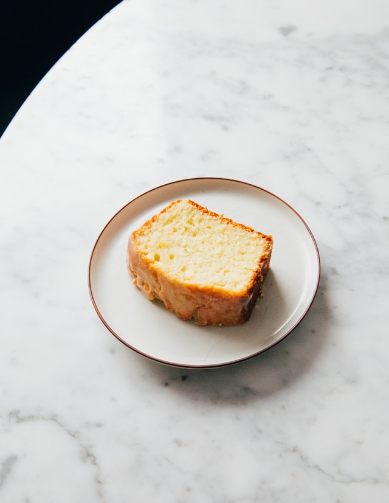

= Cake

De geur van versgebakken cake. Wie is er niet verliefd op?

****
Een bekend verhaal rondom Marie Antoinette is dat toen ze vernam dat het Franse
volk geen brood had om te eten, ze zou hebben gezegd: “S’ils n’ont pas de pain
qu'ils mangent de la brioche!” (meestal vertaald als: “Als ze geen brood hebben,
dan eten ze toch cake!”), daarmee duidelijk makend dat ze geen flauw benul had
van de ware situatie waarin het volk verkeerde.
****

== Ingrediënten

- 250 g cakemeel
- 250 g ongezouten roomboter
- 250 g fijne kristalsuiker
- 1 mespunt zout
- 5 middelgrote eieren
- 1 vanillestokje

=== Keukenspullen

Cakevorm (30 cm)::
    Met een *bakvorm* (ook: *_bakblik_*) wordt een van metaal in een bepaalde
    vorm gemaakt model bedoeld om bijvoorbeeld een
    https://nl.wikipedia.org/wiki/Taart[taart],
    https://nl.wikipedia.org/wiki/Cake_(gebak)[cake],
    https://nl.wikipedia.org/wiki/Tulband_(gebak)[tulband] of
    https://nl.wikipedia.org/wiki/Brood[brood] te kunnen
    https://nl.wikipedia.org/wiki/Bakken[bakken].

Satéprikker::
    *Saté* is van oorsprong een
    https://nl.wikipedia.org/wiki/Indonesi%C3%AB[Indonesisch] en
    https://nl.wikipedia.org/wiki/Maleisi%C3%AB[Maleisisch] gerecht,
    bestaande uit drie of meer stukjes geroosterd vlees op een dunne houten
    spies, meestal van bamboe.

== Bereiden

1. Verwarm de oven voor op 180 °C. Vet de cakevorm in en bestuif met *1 el
   cakemeel*.
2. Doe de *boter*, *suiker* en het *zout* in een beslagkom en klop in 10 min.
   met een mixer tot een *luchtige* massa. Klop 1 voor 1 de *eieren* erdoor.
   Voeg een volgend *ei* toe als het vorige is opgenomen.
3. Snijd het *vanillestokje* open en schraap het merg er met een mespunt uit.
   Zeef het *cakemeel* boven het beslag en spatel met het *merg* erdoor.
4. Schep het beslag in de vorm en zet deze in het _midden_ van de oven.
   Verlaag de oventemperatuur naar 170 °C en bak de cake in ca. 1 uur
   goudbruin. Controleer na ca. 50 min. op gaarheid. Prik de satéprikker
   in het midden van de cake. Komt deze er _schoon_ uit, dan is de cake gaar.

*Variatietip*: Voeg 30 g cacao toe voor een chocoladecake.

== Opeten

|===
| Stap | Handeling | Opmerking

| Één
| Open de mond
| Doe de tanden ook van elkaar

| Twee
| Schuif de plak naar binnen
| Met handen of een vorkje

| Drie
| Kauw
| Goed kauwen, dan komt de cake gelijknamig in het bloed

| Vier
| Slik door
| Wel in het goede gat mikken

| Vijf
| Terug naar stap één
| Tot de cake op is
|===

== Beoordelingen

[quote, C. Beslag]
Fantastische cake, heerlijk recept! Mijn oven stond wel 10 graden warmer.

[quote, S. Mixer]
Ik doe er een beetje cacao doorheen, lekker lekker lekker.

[quote, V. Ganist]
Je kunt ook veganistische cake maken, met plantaardige boter en nep-ei.
